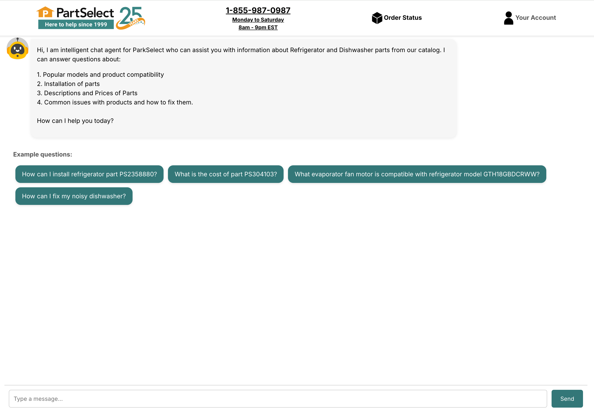
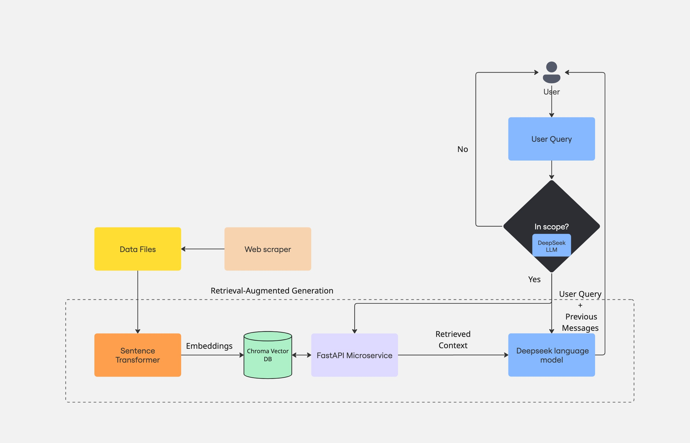
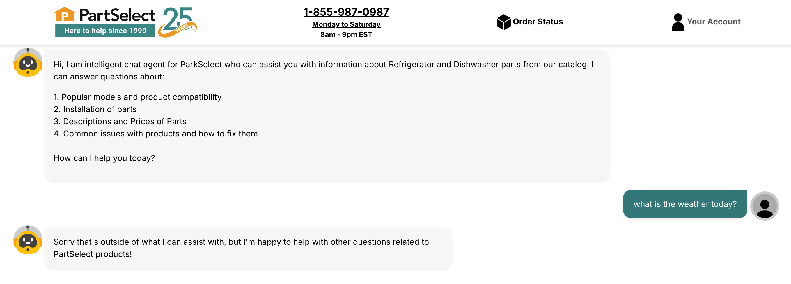
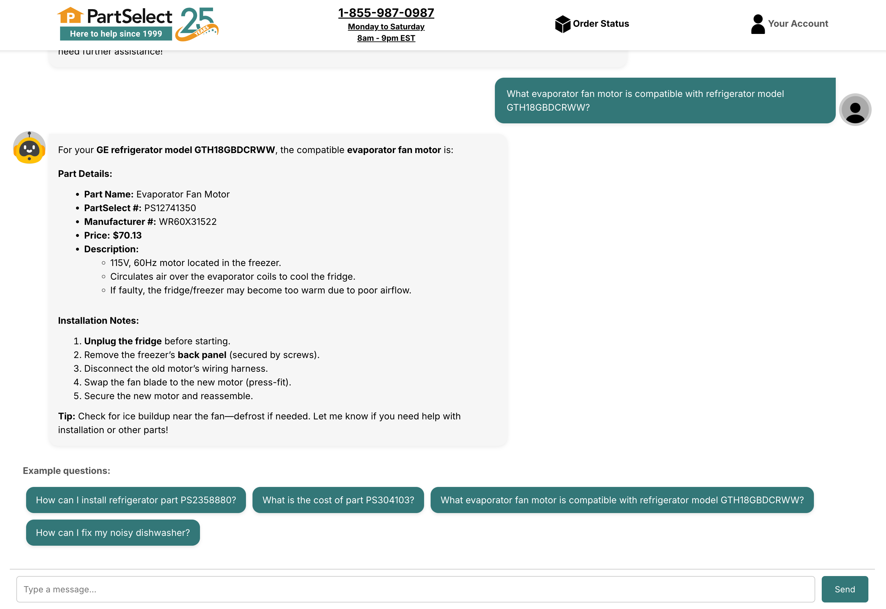
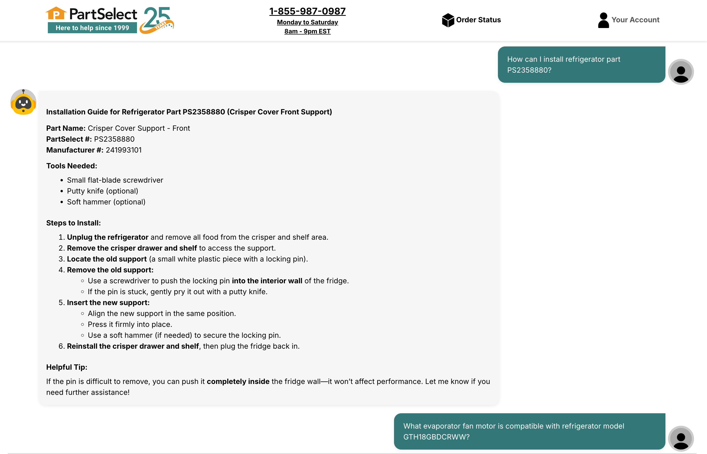

## PartSelect Chat Agent

This is a chatbot agent for the PartSelect e-commerce website that
answers question on the Refrigerator and Dishwasher parts product catalog. The 
agent uses a Retrieval-Augmented Generation (RAG) framework to retrieve relevant information from data about popular Refrigerator and Dishwasher parts and then using that information to augment the prompt provided to the DeepSeek LLM. 

It first uses an API call to the DeepSeek LLM to ascertain whether a user query is within scope and performs another LLM call to generate a response if it is, if not it relays its scope to the user.
The agent is also capable of mulit-round conversation by passing previous messages to LLM when generating a response. 

The PartSelect product data is obtained by scraping the parts and repair pages for Refrigerator and Dishwasher product types (see `python_backend/webscrappers` for more info). 

The chatbot is run using a ReactJS frontend (see `/frontend directory`) with a python backend for the vector database and Microservice API for querying the ChromaDB database to retrieve context. It is able to answer questions related to PartSelect products based on
what it obtains through this context. 

Some example queries are: 

### Possible extensions: 
- Caching user queries to avoid multiple unnecessary calls to LLM API. 
- Run more intense scraping script to capture more product data. 
- Add more links to PartSelect website for images and videos (currently only limited to fix troubleshooting websites). 

